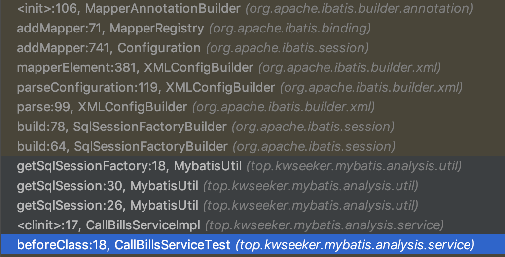
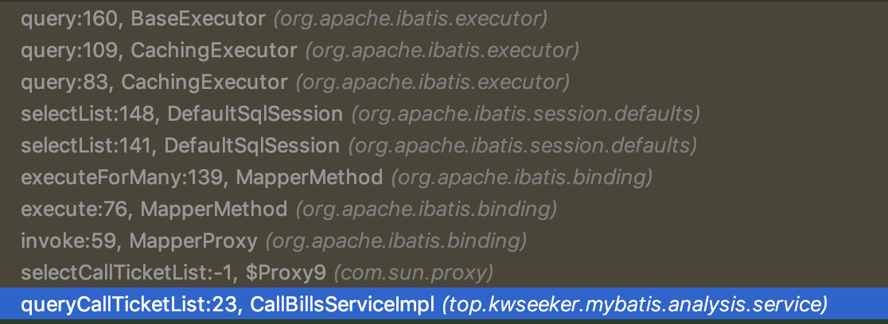

# MyBatis源码分析

## <font color="blue"> 准备工作 </font>

将 MyBatis 包的源码下载下来；不然 Idea 无法搜索源码。

查找 MyBatis 类被调用位置的快捷键：`Option + F7`

刚开始不要一行行地读代码，要根据类和方法名猜测其功能（主要关注非private方法，和初始化方法或代码块），
然后根据这些类和方法名猜测功能大概是怎么实现的。然后根据自己的猜测选择在代码中合理的位置加断点，调试。

为了使分析 Mybatis 代码更清晰，尽量不要引入其他没有必要的库。
一个`Java命令行`+`Mybatis`就好,所以下面这个接口需要从公司代码中提到这个Java命名行应用工程中。

## 如何定位源码

比如以下面这个工作中写的一个Mapper接口为例看看Mybatis源码是怎么读取并解析执行的。
```
@Select("<script>" +
        "select \n" +
        "    tnbi.tel_x,\n" +
        "    tcri.call_no,\n" +
        "    tcri.peer_no,\n" +
        "    tcri.finish_state,\n" +
        "    tcri.call_time,\n" +
        "    tcri.start_time,\n" +
        "    tcri.finish_time,\n" +
        "    tcri.call_duration\n" +
        "from tb_call_record_info tcri, tb_number_bind_info tnbi\n" +
        "where \n" +
        "<if test = \"callNo != null and callNo != '' \">\n" +
        "    call_no = #{callNo}\n" +
        "</if>\n" +
        "<if test = \"peerNo != null and peerNo != '' \">\n" +
        "    and peer_no = #{peerNo}\n" +
        "</if>\n" +
        "<if test = \"finishState != null and finishState != '' \">\n" +
        "    and finish_state = #{finishState}\n" +
        "</if>\n" +
        "<if test = \"callTime != null and callTime != '' \">\n" +
        "    and call_time = #{callTime}\n" +
        "</if>\n" +
        "and tcri.bind_id in (\n" +
        "    select bind_id from tb_number_info tni, tb_number_bind_info tnbi\n" +
        "    where tni.id = tnbi.number_info_id\n" +
        "       and tni.enterprise_id = #{enterpriseId}\n" +
        "    <if test = \"appId != null and appId != '' \">\n" +
        "       and tni.app_id = #{appId}\n" +
        "    </if>\n" +
        "    <if test = \"poolType != null and poolType != '' \">\n" +
        "       and tni.pool_type = #{poolType}\n" +
        "    </if>\n" +
        "    <if test = \"telX != null and telX != '' \">\n" +
        "       and tni.tel_x = #{telX}\n" +
        "    </if>\n" +
        ")\n" +
        "and tcri.bind_id = tnbi.bind_id\n" +
        "</script>")
List<QueryCallTicketListResp> selectCallTicketList(QueryCallTicketListReq req);
```

1. 我们按Mybatis规则定义了这个接口的功能，调用的时候，Mybatis肯定需要解析它；应该是通过
注释读取到的。然后看 @Select。

2. @Select 本身没有有效信息，然后看它在哪里被使用 `Option + F7`。跳转到 `MapperAnnotationBuilder`。
然后先看它的`初始化代码块`和`public方法`，然后可以在里面加断点。

    初始化方法
    ```
    public MapperAnnotationBuilder(Configuration configuration, Class<?> type) {
        String resource = type.getName().replace('.', '/') + ".java (best guess)";
        this.assistant = new MapperBuilderAssistant(configuration, resource);
        this.configuration = configuration;
        this.type = type;
    }
    ```

    很庆幸只有一个public方法(作为对外的窗口，它一定是最核心的方法)
    ```
    public void parse() {
        String resource = type.toString();
        if (!configuration.isResourceLoaded(resource)) {
          loadXmlResource();
          configuration.addLoadedResource(resource);
          assistant.setCurrentNamespace(type.getName());
          parseCache();
          parseCacheRef();
          Method[] methods = type.getMethods();
          for (Method method : methods) {
            try {
              // issue #237
              if (!method.isBridge()) {
                parseStatement(method);
              }
            } catch (IncompleteElementException e) {
              configuration.addIncompleteMethod(new MethodResolver(this, method));
            }
          }
        }
        parsePendingMethods();
    }
    ```
    
3. `MapperAnnotationBuilder`构造方法的调用堆栈 和 parse()被调用的地方。

    + `MapperAnnotationBuilder`构造方法的调用堆栈
        
        SqlSessionFactory初始化流程堆栈图（注意这里只是主要的流程）
        
        
        可以在这个堆栈流程中添加断点获取参数信息，以及猜测每个类的功能  
        
        `SqlSessionFactoryBuilder`  
        主要做了两件事：创建配置解析器；解析配置。
        ```
        XMLConfigBuilder parser = new XMLConfigBuilder(inputStream, environment, properties);
        return build(parser.parse());
        ```
        
        `XmlConfigBuilder`  
        解析配置
        ```
        //看代码 XNode root 来自 parser.evalNode("/configuration")
        //猜想是对应的mybatis-config.xml <configuration></configuration> 节点
        //这个执行完之后配置应该会被读取到 root
        private void parseConfiguration(XNode root) {
            try {
              //读取<properties></properties>中的属性
              // 1）<properties>节点可以有子节点，子节点会直接被当作属性值以键值对的方式读出
              // 2）<properties>可以通过source参数指定包含属性的本地文件
              // 3）<properties>也可以通过url指定包含属性的文件，但是url和source只能两选一，否则报BuilderException
              // 4）从configuration中读取属性variables，configuration的variables属性从哪里来的？（TODO）
              //    找到configuration的定义处在 BaseBuilder 的构造方法中，按 Option + F7 发现这个构造方法有7个地方引用
              //    根据代码推测是 XMLConfigBuilder 的构造方法传入的 
              //    private XMLConfigBuilder(XPathParser parser, String environment, Properties props){...}
              //    最终找到属性是从 SqlSessionFactoryBuilder 的 build() 方法传入的这个是用户可以直接调用的
              //    public SqlSessionFactory build(InputStream inputStream, String environment, Properties properties)
              // 5）前面读出的属性值会汇总到 defaults ，然后分别存入 parser 的 variables 变量 以及 configuration 的 variables
              propertiesElement(root.evalNode("properties"));
              
              //读取<settings></settings>中的设置，完整的设置查看 http://www.mybatis.org/mybatis-3/zh/configuration.html
              // 1）将所有设置项读取到 Properties 中，
              // 2）对设置项进行校验确保设置可识别，然后返回 Properties 对象。
              Properties settings = settingsAsProperties(root.evalNode("settings"));      
              //如果<settings></settings>中有设置"vfsImpl",则加载实现类并赋值到 configuration 中 （TODO：vfsImpl设置项的作用？后面代码中寻找答案）
              loadCustomVfs(settings);
              
              //读取<typeAlias></typeAlias>中的<package>设置和<typeAlias>设置
              //用于为类型指定一个简短的别名
              // 1）如果是<package>设置则遍历加载并注册这个路径下所有的类（这些类一般是数据库表的映射类）；
              // 2）如果是<typeAlias>则加载 type 指定的类并注册。
              // 3）同样可以使用 @Alias 为数据库表映射类设置别名（TODO：）
              typeAliasesElement(root.evalNode("typeAliases"));
              
              //读取<plugins></plugins>中的设置，和前面的套路一样，读取plugin类路径，然后加载创建实例，并存入 configuration 中
              //plugins指定的类用于在已映射语句执行过程中的某一点进行拦截调用，和spring的拦截器一样
              pluginElement(root.evalNode("plugins"));
              
              //读取<objectFactory></objectFactory>中的设置，读取 type 指定的类的路径 和 property参数，加载并创建实例，并存入 configuration 中
              //用于创建自己的结果对象工厂，会覆盖默认的对象工厂 DefaultObjectFactory。
              objectFactoryElement(root.evalNode("objectFactory"));
              
              //读取<objectWrapperFactory></objectWrapperFactory>中的设置，读取 type 指定的类的路径加载并创建实例，并存入 configuration 中
              //（TODO）用途不详，官方文档没有将这个配置项，看后面代码是怎么解析使用这个配置项的
              objectWrapperFactoryElement(root.evalNode("objectWrapperFactory"));
              
              //读取<reflectorFactory></reflectorFactory>中的设置，读取 type 指定的类的路径加载并创建实例，并存入 configuration 中
              //（TODO）用途不详，官方文档没有将这个配置项，看后面代码是怎么解析使用这个配置项的
              reflectorFactoryElement(root.evalNode("reflectorFactory"));
              
              //前面的 settingsAsProperties() 只是读取设置项到 settings，这里是将settings设置项全部存储到 configuration 中
              settingsElement(settings);
              
              //读取<environments></environments>中的设置 并存入 configuration 中
              //可以为开发、测试、生产环境指定使用不同的配置，也可以在具有相同Schema的多个生产数据库使用相同的SQL映射
              //如果有多个数据库，就添加多个<environment>, 并为每种环境创建一个SqlSessionFactory（这种场景还没见到，至于分库分表对服务层看也只是一个数据源）
              //<environments default>指定使用哪个环境
              //<environment id> 指定此环境id
              environmentsElement(root.evalNode("environments"));
              
              //读取<databaseIdProvider></databaseIdProvider>中的设置，并存入 configuration 中
              //（TODO）用途不详，说是多种数据库支持（一个项目使用多种数据库？），看后面代码是怎么解析使用这个配置项的
              databaseIdProviderElement(root.evalNode("databaseIdProvider"));
              
              //读取<typeHandlers></typeHandlers>中的设置，并存入 configuration 中
              //类型处理器设置，Mybatis 默认会加载一些类型处理器，查看 http://www.mybatis.org/mybatis-3/zh/configuration.html#typeHandlers
              //这也是为什么我们在resultMap中不指定jdbcType时仍能成功转换，因为有默认的类型处理。
              typeHandlerElement(root.evalNode("typeHandlers"));
              
              //读取<mappers></mappers>中的设置，并存入 configuration 中
              // 工作流程见下面的总结
              //指定Mapper接口类
              //也可以通过 @Mapper 注解指定
              mapperElement(root.evalNode("mappers"));
            } catch (Exception e) {
              throw new BuilderException("Error parsing SQL Mapper Configuration. Cause: " + e, e);
            }
        }
        ```
        
        `Configuration`  
        
        `MapperRegistry`  
        用于注册代码中的各个Mapper接口。  
        
        `MapperAnnotationBuilder`  
        猜测这个类是通过前面读取的配置以及接口定义及注解信息，组装Mapper接口的，这个类的每个实例针对一个Mapper接口
        如本例的 top.kwseeker.mybatis.analysis.dao.TbCallRecordDao 。  
        
        继续往后执行可以看到整个完整的初始化流程，最终返回`SqlSessionFactoryBuilder`成功构建一个
        SqlSessionFactory，后面就是Mapper接口调用流程转到第4小节。  
        
    + parse() 被 `MapperRegistry.addMapper()`调用
    
        parse() 在MapperRegistry.addMapper()的时候执行，工作流程：  
        1）加载Mapper接口的sql实现，从XML加载或者从 加载；
        2）解析上面加载的内容, 实现方法为`parseStatement()`，并加映射结果放入assistance（后面执行时应该是从这里面取）。
        ```
        parameterTypeClass  //参数类型，如案例的QueryCallTicketListReq
        languageDriver      //自定义的参数解析规则
        sqlSource           //用于生成sql Builder
        assistance          //
        ```
        3）
        
4. 使用通过解析注解或XML生成的`SqlSessionFactory`创建`SqlSession` 
    
    需要找到创建sql后调用获取结果的那个点加断点，然后就可以看到4，5，6的执行流程的堆栈信息。
    
    先放出来这个示例执行查询的堆栈图
    

    `MapperProxy`
    
    `MapperMethod`
    
    `DefaultSqlSession`
    
    `CachingExecutor`
    
    `BaseExecutor`
    ```
    @Override
    public <E> List<E> query(Statement statement, ResultHandler resultHandler) throws SQLException {
        PreparedStatement ps = (PreparedStatement) statement;
        ps.execute();
        return resultSetHandler.<E> handleResultSets(ps);
    }
    ```
    
5. 使用`SqlSession` getMapper创建sql

6. 执行生成的sql完成查询。


总结：

两个重要的断点位置：  
1）初始化阶段：`MapperBuilderAssitant.addMappedStatement()`, 在这个位置加断点可以看到最完整的初始化阶段的堆栈信息。  
2）执行阶段：`PreparedStatementHandler.query()`, 在这个问题之加断点可以看到最完整的执行阶段的堆栈信息。  
上面说的只是适用这个示例。不同的配置和sql类型可能对应不同的位置（反正都是数据刚生成且待返回之前）。

重要的成员：

+ Configuration (Configuration.java)
    
    存储全局的配置, 从上面分析可以看到整个初始化阶段都在装配这个实例 configuration。

+ MappedStatement (MappedStatement.java)
    
    是初始化完成后的结晶，每个Mapper接口的每个方法都会有个 MappedStatement 类型的实例，存储在 configuration 和 assistance 中。
    通过这个类，可以在运行时，创建出 JDBC 的 Statement。

重要的方法：

+ 配置读取

    `XMLConfigBuilder.parseConfiguration()`

+ Mapper接口方法组装

    `XMLConfigBUilder.mapperElement()`
    
    1) 从Mappers中读取所有Mapper配置或者package值中的配置, 这个配置告诉Mybatis去哪里找映射文件；
    
        - mapper
       
            resource：通过相对目录路径指定；
            url：使用URL指定；
            class: 通过java包的路径指定（貌似需要在注解中定义sql语句）。
            
            三选一。
    
        - package    
        
            name：包含Mapper接口类的java package路径。
    
        mapper和package可以混合使用。
        
    2）以`<mapper class="top.kwseeker.mybatis.analysis.dao.TbCallRecordDao"/>`为例
    
        - 加载类
        
        - 注册 Mapper 类到 configuration
        
            ```
            mapperRegistry.addMapper(type);
            
            public <T> void addMapper(Class<T> type) {
                if (type.isInterface()) {
                  if (hasMapper(type)) {
                    throw new BindingException("Type " + type + " is already known to the MapperRegistry.");
                  }
                  boolean loadCompleted = false;
                  try {
                    knownMappers.put(type, new MapperProxyFactory<T>(type));
                    // It's important that the type is added before the parser is run
                    // otherwise the binding may automatically be attempted by the
                    // mapper parser. If the type is already known, it won't try.
                    MapperAnnotationBuilder parser = new MapperAnnotationBuilder(config, type);
                    parser.parse();
                    loadCompleted = true;
                  } finally {
                    if (!loadCompleted) {
                      knownMappers.remove(type);
                    }
                  }
                }
            }
            ```
            
            先将这个Mapper类添加到knownMappers（存储已经映射好的Mapper类）中；
            然后读取 configuration中 typeAliasRegistery typeHandlerRegistery 配置，
            转换 resource 路径，创建 MapperAnnotationBuilder 注解解析器；
            
        - sql 注解解析 
        
            ```
            public void parse() {
                String resource = type.toString();
                if (!configuration.isResourceLoaded(resource)) {
                  loadXmlResource();
                  configuration.addLoadedResource(resource);
                  assistant.setCurrentNamespace(type.getName());
                  parseCache();
                  parseCacheRef();
                  Method[] methods = type.getMethods();
                  for (Method method : methods) {
                    try {
                      // issue #237
                      if (!method.isBridge()) {
                        parseStatement(method);
                      }
                    } catch (IncompleteElementException e) {
                      configuration.addIncompleteMethod(new MethodResolver(this, method));
                    }
                  }
                }
                parsePendingMethods();
            }
            ``` 
            
            根据 Mapper 接口的类型，尝试加载其对应的 xml 文件
    
    3）`parseStatement()`
    
        获取参数类型；
        获取自定义的XMLLanguageDriver; （TODO：什么时候加载进去的？）；
        从注解中读取sqlSource（配置+sql脚本片段） `getSqlSourceFromAnnotations()` (这个方法获取Mapper接口类的某个方法的sql注解类型，
        如：本例 "interface org.apache.ibatis.annotationb.Select",以及动态生成的sql注解类，以及sqlProvider注解类型；
        然后解析注解中的sql语句)；
        读取 Options.class 注解内容；
        如果是 Insert / Update 操作，读取 SelectKey.class 注解内容，设置主键自增；
        读取 ResultMap.class 注解内容，设置返回值映射；
        构造 sql 的 MappedStatement(这个类包含了构造一个Statement的全部条件) `MapperBuilderAssistant.addMappedStatement()`；
        将 MappedStatement 存入 configuration; 
        将 statement 语句存储到 assistant;

附录：

+ 如果想要学习XML文件如何解析，可以参考Mybatis XPathParser.java的实现

+ `MapperAnnotationBuilder.getSqlSourceFromAnnotations()` 本身也是注解解析处理的一个范例
    
    对注解工作原理不清楚可以研究下这个方法的细节实现。

## typeHandler 的原理源码分析

## 从源码理解 SqlSessionFactory 和 SqlSession 的声明周期

## 从源码角度理解 resultMap 和 resultType 的区别

结果映射 | 优点 | 缺点
---|---|---
resultType | 多表关联字段清楚知道，性能调优直观 | 需要创建很多实体类
resultMap | 不需要写join语句 | N+1 问题

N+1问题：
使用 resultMap 做嵌套查询，总是进行 N+1次查询；即使只需要第一次查询结果中的数据。

## 从源码理解嵌套查询流程

